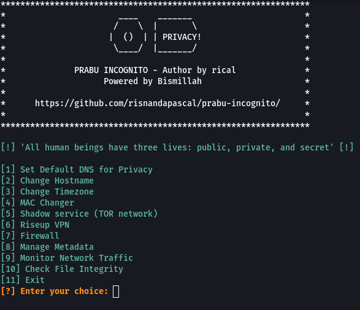

# PRABU INCOGNITO



Prabu Incognito (raja yang menyamar) adalah kumpulan alat yang berfokus pada privasi, dirancang untuk meningkatkan keamanan dan anonimitas. 

## Fitur

| Fitur                    | Deskripsi                                                                                                       |
|--------------------------|-----------------------------------------------------------------------------------------------------------------|
| Set Default DNS          | Mengganti server DNS default pada sistem dengan server DNS yang berbasis privasi (generated by whoami-project). |
| Change Hostname          | Mengganti nama host dengan nama acak untuk bersembunyi.                                                         |
| MAC Changer              | Mengubah MAC Address secara acak pada interface jaringan yang ditentukan dan me-reset MAC Address ke default.    |
| Shadow service (Nipe)    | Menginstal, memeriksa status, memulai, menghentikan, atau me-restart layanan TOR.                              |
| Riseup VPN               | Menjalankan Riseup VPN.                                                                                        |
| Firewall                 | Mengkonfigurasi firewall sistem untuk memblokir lalu lintas masuk, kecuali untuk SSH, dan memberikan informasi tentang aturan yang diterapkan. |
| Manage Metadata          | Menghapus dan membaca metadata file.                                                                            |
| Change Timezone          | Mengubah zona waktu untuk menghindari kebocoran lokasi dari jam sistem.                                         |
| Monitor Network Traffic  | Memantau untuk mendeteksi aktivitas yang mencurigakan atau memahami lalu lintas jaringan yang sedang berlangsung. |
| Check File Integrity     | Memeriksa integritas file sistem untuk mendeteksi perubahan yang tidak sah.                                      |

## Prasyarat

- Debian-based Linux (Kali Linux direkomendasikan)
- Bash atau Zsh

## Download dan install

1. **Clone repository dan masuk ke directory**
   ```bash
   git clone https://github.com/risnandapascal/prabu-incognito/ && cd prabu-incognito
   ```
3. **Ubah perizinan:**
   ```bash
   chmod +x install.sh
   chmod +x prabu.sh
   ```
4. **Install dependencies:**
   ```bash
   ./install.sh
   ```
## Run:
   ```bash
   ./prabu.sh
   ```
1. **Pilih opsi yang akan digunakan.**

2. **instruksi untuk layanan Shadow:**
   ```bash
   help
   ```
   ```bash
   install
   ```
   ```bash
   status
   ```
   ```bash
   start
   ```
   ```bash
   stop
   ```
   ```bash
   status
   ```

## Catatan
- Ada beberapa yang memerlukan izin superuser/sudo.

## Lisensi
Alat ini dilisensikan di bawah  <a href="LICENSE.md">Lisensi MIT.</a>